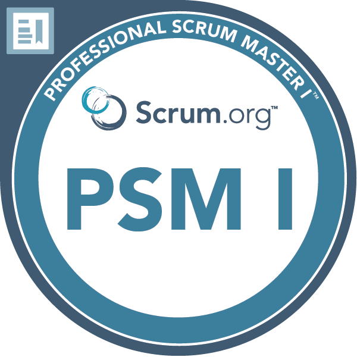
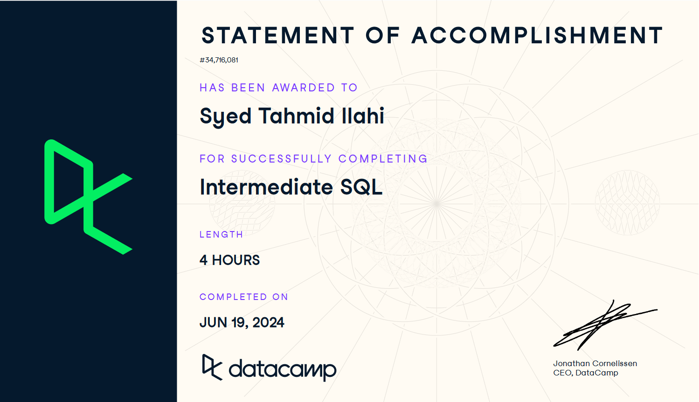

# Data Analyst

## <u>Technical Skills</u>

**Data Analysis & Visualization:**  
MS Excel, Python (Pandas, NumPy, Matplotlib, Scikit-learn), Power BI, SAS Viya

**Databases & Query Language:**  
MySQL, SQL Server Management Studio, Hadoop (HDFS, Hive)

## <u>Education</u>
**PGD, Business Insights and Analytics** | 
Humber College, Canada (_October 2018_)

**B.Sc., Electrical and Electronic Engineering** | 
Ahsanullah University of Science and Technology, Bangladesh (_October 2018_)

## <u>Projects</u>
- **[Credit Card Fraud Detection using ML Models](https://github.com/tahmidilahi/credit_card_fraud_detection_algorithm)**
- **Sales and Operation Analysis BI Dashboard for a Toronto Pizza Franchise**
- **End-to-end BI Solution for A Packaging Company**

## <u>Work Experience</u>
### Deposit Monitoring Officer 
**Royal Bank of Canada** (_Jun 2023 - Apr 2024_)
- Streamlined payment processing workflows through trend and anomaly analysis, improving operational efficiency and reducing processing time.
- Maintained monthly data accuracy rates exceeding 98% by optimizing data input processes.
- Achieved a 20% improvement in performance goals within six months by executing targeted strategies to enhance payment monitoring.

### Technical Manager
**Isabah Packaging and Accessories Industries (IPAI)** (_Feb 2021 - Dec 2022_)
- Led the successful implementation of a CRM system and BI dashboard, driving real-time insights that resulted in a 3.7% increase in sales in Q3 2022.
- Boosted production capacity by 13% and revenue by 6% through efficient project management and process improvements.
- Managed cross-functional teams on projects worth CAD 1.6 million, focusing on workforce safety, sustainable energy solutions, and production expansion.

### Engineering Trainee 
**Korean Electric Power Corporation** (_Jul 2019 - Feb 2021_)
- Enabled data-driven decisions and cost efficiency optimization by conducting comprehensive trend analysis of plant equipment and resources, leading stakeholders to initiate preventive maintenance.
- Increased plant availability by 11% YoY by leveraging plant generation data to analyze fuel consumption, power output, and forecast power demand, facilitating data-driven decisions. 
- Enhanced emergency response times by 15% by providing technical expertise in efficiency planning and project management, supporting the Shift Charge Engineer.

## <u>Certificates</u>
      

Ordered from left to right: 
- **Professional Scrum Master™ I**, _Scrum.org_ (_Sep 2024_) 
- **Intermediate SQL**, _DataCamp_ (_Jun 2024_)
- **Azure Data Fundamentals**, _Microsoft_ (_Mar 2024_) 
